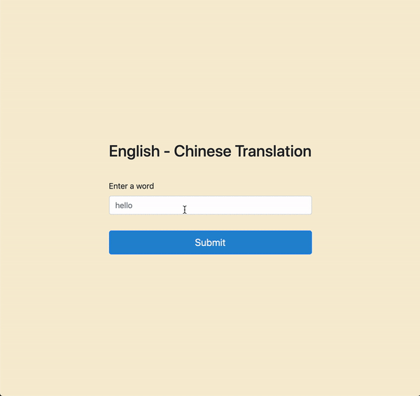

# translation-parse
> Scraps websites to create translations.

## Meta

Sevan Golnazarian – [@Portfolio](https://sevanbadal-portfolio.herokuapp.com/) – sgolnaza@gmail.com

[https://github.com/sevanbadal/github-link](https://github.com/sevanbadal/)

## Contributing

1. Fork it (<https://github.com/sevanbadal/translation-parse/fork>)
2. Create your feature branch (`git checkout -b feature/fooBar`)
3. Commit your changes (`git commit -am 'Add some fooBar'`)
4. Push to the branch (`git push origin feature/fooBar`)
5. Create a new Pull Request
